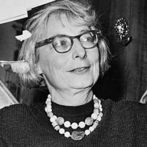

Time for my annual “books I read last year” post.

I read thirty books this year, which is down from previous years but that doesn’t include the dozens of journal articles I read for the classes I’ve been taking at UBC (having digital access to all the journal through the UBC library system is *amazing*). Nor does it account for the three months this spring when I didn’t complete a book while I was working on a paper on social justice and transportation policy for the Social Justice and the City class I was in. That ended up being the longest thing I’ve written since my senior thesis.

For non-fiction, I’d call out “The New Jim Crow” by Michelle Alexander, “Evicted” by Matthew Desmond, “The Line Becomes a River” by Francisco Cantú, and “The Death and Life of Great American Cities” by Jane Jacobs. All great reads.

Fiction-wise reading Updike’s Rabbit series was definitely the high point. I re-read “Monkey Beach” by Eden Robinson and her latest book, Trickster Drift. I gave J.G. Ballard another go and read “High Rise” but I still think he is awful.

Also worth calling attention to the writings of Iris Marion Young. Political philosophy isn’t what you typically want to curl up on the couch and read but her books are exceptionally well written. She and Jane Jacobs are the two thinkers whose works I was most inspired by this year.

